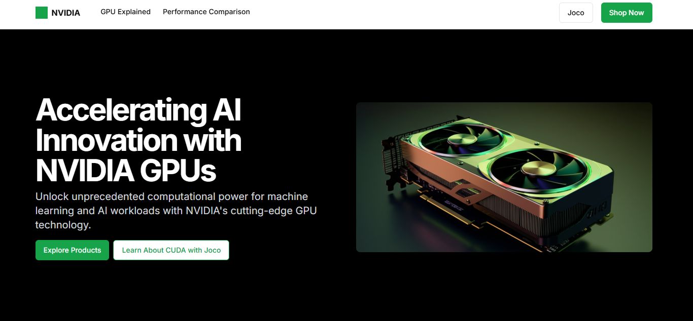

# GPU Portofolio Website

## Description
This project is a Next.js application with Tailwind CSS and other modern web technologies.

## Getting Started
1. Clone the repository
2. Install dependencies with `pnpm install`
3. Run the development server with `pnpm dev`

## Features
- Modern UI with Tailwind CSS
- Next.js for server-side rendering
- TypeScript for type safety

## License
MIT 